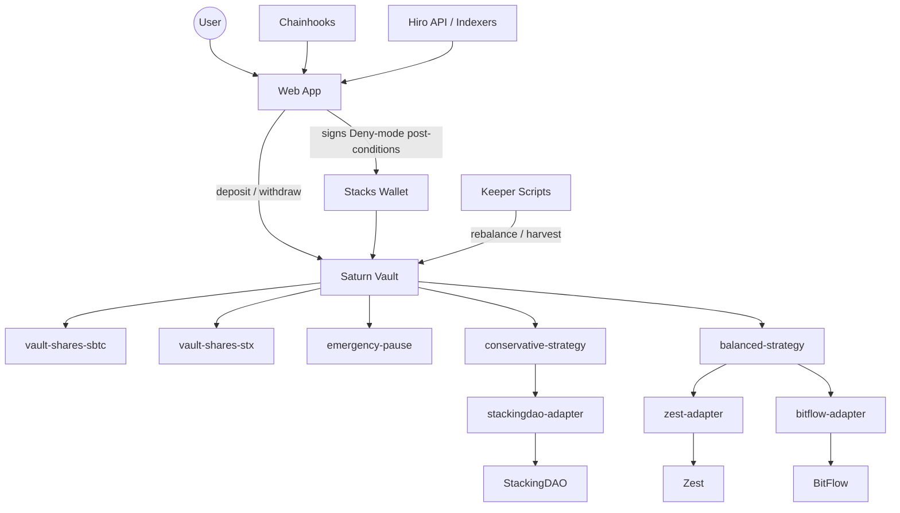

# Architecture

## System overview

Saturn is organized as a strategy-vault system with separate control and data planes.
The vault is the user-facing trust boundary. Strategies express allocation policy.
Adapters normalize protocol-specific ABIs into a smaller Saturn surface. Keepers,
chainhooks, and the web app sit around that core to make the system operable.

## Core components

### Vault layer

- `saturn-vault`: custody, accounting, operator controls, allowlists, and user
  entrypoints for `sBTC` and `STX`
- `vault-shares-sbtc` and `vault-shares-stx`: domain-specific SIP-010 share receipts
- `emergency-pause`: pause control and admin authority used by the vault

The vault is the product boundary reviewers should focus on first. It owns user
deposits, tracks idle versus managed balances, enforces strategy and adapter
allowlists, and exposes the emergency paths that protect users when upstream
integrations are unavailable.

### Strategy layer

- `conservative-strategy`: the lower-risk STX route centered on StackingDAO exposure
- `balanced-strategy`: the higher-yield route that combines Zest and BitFlow paths

Strategies do not receive arbitrary user input. They are selected by governance from a
known set and are intentionally small so the vault remains the main place where
security-critical logic is reviewed.

### Adapter layer

- `zest-adapter`
- `stackingdao-adapter`
- `bitflow-adapter`

Adapters are the compatibility boundary between Saturn and upstream protocols. Their
job is not to invent yield logic. Their job is to translate Saturn's internal notion
of deposit, withdraw, harvest, and position into the exact ABI of each protocol while
keeping exact-principal controls in place.

### Operations and interface layer

- `scripts/keeper/`: operator entrypoints for rebalance and harvest automation
- `chainhooks/`: event hooks for deposit, withdrawal, and rebalance monitoring
- `apps/web/`: wallet-connected UX for deposits, withdrawals, and vault state

This layer is where Saturn's product moat becomes visible to users. The contracts
provide the safety model; the app and automation surface provide the "one place to
use Bitcoin DeFi" experience.

## Control plane and operating policy

Saturn is not designed as a "set it and forget it" black box. The contracts define
what is allowed; the keeper and monitoring stack define when Saturn should use those
permissions.

The intended control-plane loop is:

1. Chainhooks or equivalent monitoring surface new deposits, withdrawals, rebalance
   actions, and protocol health signals.
2. The keeper reads authoritative on-chain state from the vault before building any
   transaction.
3. The keeper refuses to act if the vault is paused, if required adapters are no
   longer approved, or if the target action would widen exposure during degraded
   protocol conditions.
4. Only after those checks pass does the operator submit `rebalance` or `harvest`
   directly to the vault.

That direct-call model matters because `saturn-vault` requires operator calls to come
from the signer itself rather than through a helper contract. In other words, the
automation layer is intentionally constrained by the same on-chain authentication
rules that a human operator would face.

### Minimum keeper pre-flight checks

Before any rebalance or harvest call, the operator should validate:

- the vault is not paused,
- the intended strategy is still approved,
- every required adapter for that strategy is still approved,
- idle balances justify the proposed action,
- no protocol-specific incident flag has been raised off-chain,
- and the signed transaction includes Deny-mode post-conditions consistent with the
  intended asset movement.

The keeper should treat analytics as advisory and vault state as authoritative. APY,
TVL, and market context can influence policy, but they should not override the vault's
own pause state, allowlists, or liquidity accounting.

## End-to-end flow

### Deposit and mint

1. A user connects a Stacks wallet in the frontend.
2. The app composes a transaction with Deny-mode post-conditions.
3. The user deposits `sBTC` or `STX` into `saturn-vault`.
4. The vault records idle liquidity and mints the matching share token.

### Allocation and rebalance

1. The vault holds idle balances until an approved operator calls `rebalance`.
2. `rebalance` checks pause state, active strategy approval, and required adapter approval.
3. The active strategy allocates only through exact-principal adapters.
4. Adapters route value to the pinned upstream protocol surfaces.

In practice, the operator layer should preserve some discretion here. The technically
allowed action is not always the operationally correct action. For example, if one
adapter is healthy on-chain but the upstream team is still investigating an incident,
Saturn should leave capital idle rather than force deployment just because a rebalance
call could succeed.

### Harvest and compounding

The current MVP keeps harvest mocked, but the target production flow is explicit:

1. Keeper observes vault and protocol state.
2. Keeper triggers `harvest`.
3. Strategy claims protocol rewards.
4. Reward assets are swapped into the base asset through a reviewed DEX route.
5. Proceeds are returned to the vault and counted as fresh principal for reinvestment.

This collector -> swap -> reinvest loop is central to Saturn's product direction even
though the grant MVP stops short of wiring live swaps.

### Withdrawal and emergency paths

1. A user calls a normal withdrawal if the protocol is healthy.
2. If managed liquidity must be recalled, the vault requests assets from the strategy.
3. The vault only completes the withdrawal after liquidity is actually available.
4. If the protocol is paused, the user can still use the safe withdrawal path for idle funds.

For the conservative STX route, the live path is more specific than a generic
"recall assets" step. StackingDAO withdrawals are asynchronous:

1. the strategy initiates withdrawal and receives a withdrawal receipt,
2. the receipt matures after the protocol's unlock conditions are met,
3. a follow-up claim turns that matured receipt back into STX,
4. the vault then treats the claimed STX as idle liquidity available for redemption.

The grant MVP does not yet model that receipt as a live on-chain object, but the
architecture is intentionally documented with that future shape in mind so the
reviewers can see the difference between synchronous liquidity and pending withdrawal
state.

## Design choices that express the moat

- Saturn is not just a vault; it is a management layer over fragmented Stacks yield
  surfaces.
- Separate accounting domains for `sBTC` and `STX` avoid accidental cross-domain
  leakage and make future NAV math clearer.
- Exact-principal allowlists turn trait-based modularity into a controlled integration
  surface instead of an open plugin risk.
- Saturn treats operations as part of the product, not an invisible admin backdoor:
  the keeper, chainhooks, and frontend are designed to make policy, state, and
  incident handling legible.
- The web, keeper, and chainhook layers are designed to make the product feel like one
  system instead of three separate protocol dashboards.

## What is intentionally deferred

The following are part of Saturn's roadmap but are not claimed as live in this MVP:

- protocol-grade reward swapping and compounding
- APY aggregation sourced from live indexers
- automatic reallocation based on a risk engine
- full frontend transaction builder and production chainhook pipeline

Those deferred pieces are still documented here because they are part of the strategic
product direction and one reason Saturn is more than a narrow single-protocol vault.
